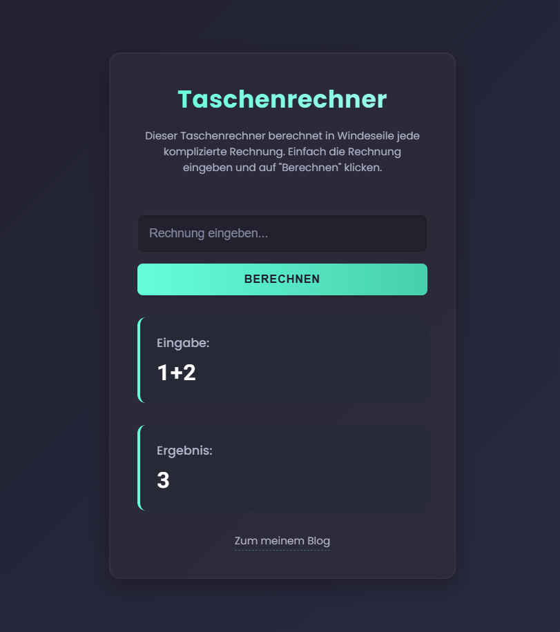

# Calculator Challenge

## Description:

This challenge aims to show how important user input sanitation is. Not all user input should be directly fed into any method available on the backend.

The goal is to inject malicious expressions into the calculator app and get access to the flag.txt file in the src directory. This challenge also contains filters if you choose a difficulty above 0, but no filter is 100% secure.

The challenge also contains a rudimentary fictional blog that contains some helpful information for solving the challenge.

## Setting up the challenge:

Build the docker image using the provided Dockerfile or use the image provided on DockerHub ([pkemkes/ctf-gptgolf](https://hub.docker.com/repository/docker/pkemkes/ctf-calculator/general)).

There are three important environment values that should be set when deploying the image on your challenge server:

| Name | Default | Description |
|--------|--------|---|
| DIFFICULTY | 0 | Determines the difficulty of the challenge. Possible values: 0, 1, 2, 3 |
| FLAG | flag{replace-me-with-your-flag} | The flag that is displayed when the challenge is won. Replace this with your flag that is registered in your CTF server. |
| APIKEY |  | Your API key for https://platform.openai.com. |

### Example docker-compose.yml:

```yaml
ctf-calculator:
    image: pkemkes/ctf-calculator
    container_name: ctf-calculator
    restart: always
    environment:
        - FLAGS=flag{super-secret-flag}
        - APIKEY=${APIKEY}
        - DIFFICULTY=3
    ports:
        - "8080:8080"
```

### Place a `.env` file next to it:

```yaml
APIKEY=your-api-key
```

## Screenshot:

