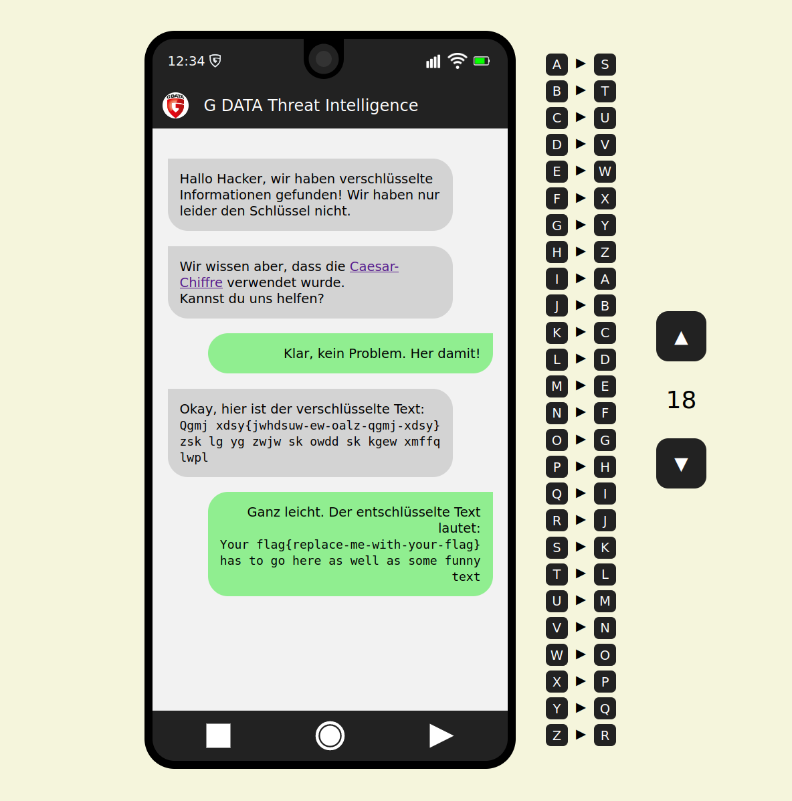

# Crypto Challange

## Description:

A webpage that looks like a phone where the player seems to have received a message from a friendly Threat Intelligence team. They ask the player to help them with decrypting some secret messages.

This is a challenge for beginners with 2 difficulty settings. It is currently in German but can easily be modified to support English players.

The first difficulty setting is very simple, it uses the Casear cipher. The tools for breaking the cipher are already implemented on the page, so that it can be solved with a couple clicks. This is more of a demo than an actually challenge.

The second difficulty setting requires actually some thinking from the player. It uses a substitution cipher. The key can be entered by dragging and dropping the characters to the corresponding place.

## Setting up the challenge:

Build the docker image using the provided Dockerfile or use the image provided on DockerHub ([pkemkes/ctf-crypto](https://hub.docker.com/repository/docker/pkemkes/ctf-crypto/general)).

There are three important environment value that should be set when deploying the image on your challenge server:

| Name | Default | Description |
|--------|--------|---|
| DIFFICULTY | 0 | Determines the difficulty of the challengen. Possible values: 0, 1 |
| KEY | ZYXWVUTSRQPONMLKJIHGFEDCBA | The key used to encrypt the challenge for difficulty level 1 |
| TEXT_TO_DECRYPT | Your flag{replace-me-with-your-flag} has to go here as well as some funny text. | The message that is to be decrypted by the player. This can be entered in clear text, the server encrypts this with a random key between 5 and 20 in case of difficulty level 0. In case of difficulty level 1, this is encrypted with the key given in KEY. This message should contain the flag that you registered in your CTF server. |

### Example docker-compose.yml:

```yaml
ctf-crypto-0:
    image: pkemkes/ctf-crypto
    container_name: ctf-crypto-0
    restart: always
    environment:
        - DIFFICULTY=0
        - FLAG=Nobody will ever know the flag{not-so-secure} with this immensly secure cipher.
    ports:
        - "80:80"
```

## Screenshot:

