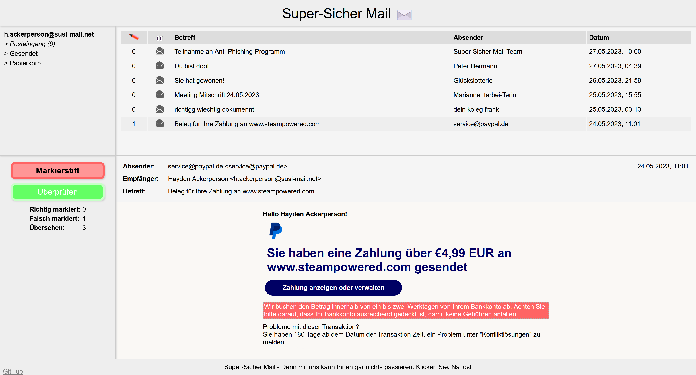

# GPT Golf Challange

## Description:

This challenge simulates an in-browser e-mail client. The player has to correctly identify all aspects of the phishing mails by selecting them with a special "marker" cursor.

This is a challenge for beginners with 2 difficulty settings. The only difference are the mails that are present. The phishing mails of the second difficulty setting are a lot more sophisticated.

## Setting up the challenge:

Build the docker image using the provided Dockerfile or use the image provided on DockerHub ([pkemkes/ctf-phishing](https://hub.docker.com/repository/docker/pkemkes/ctf-phishing/general)).

There are three important environment value that should be set when deploying the image on your challenge server:

| Name | Default | Description |
|--------|--------|---|
| DIFFICULTY | 0 | Determines the difficulty of the challengen. Possible values: 0, 1 |
| FLAG | flag{replace-me-with-your-flag} | The flag that is displayed when the challenge is won. Replace this with your flag that is registered in your CTF server. |

### Example docker-compose.yml:

```yaml
ctf-phishing-0:
    image: pkemkes/ctf-phishing
    container_name: ctf-phishing-0
    restart: always
    environment:
        - FLAG=flag{th1s-1s-n0t-s3cur3}
    ports:
        - "80:80"
```

## Screenshot:

