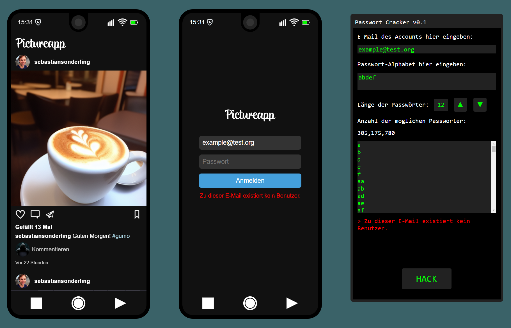

# Passwords Challenge

## Description:

This challenge simulates the situation that the player is tasked to hack into a social media account. The goal is to demonstrate the importance of long and secure passwords.

For this, the player is given a cracking tool, where a brute force algorithm is already implemented. They need to find clues in the social media stream of the victim to find details about the password.

This is a challenge for beginners with 3 difficulty settings. The fist one utilizes security questions, the second one focuses on a brute force attack, the third on a dictionary attack. It is currently in German but can easily be modified to support English players.

## Setting up the challenge:

Build the docker image using the provided Dockerfile or use the image provided on DockerHub ([pkemkes/ctf-passwords](https://hub.docker.com/repository/docker/pkemkes/ctf-passwords/general)).

There are four important environment value that should be set when deploying the image on your challenge server:

| Name | Default | Description |
|--------|--------|---|
| DIFFICULTY | 0 | Determines the difficulty of the challenge. Possible values: 0, 1, 2 |
| USERNAME | example@mail.net | The username that needs to be found in the social media stream. |
| PASSWORD | example | The passwords that needs to be cracked. For DIFFICULTY=0, this is the answer to the security question. |
| FLAG | flag{replace-me-with-your-flag} | The flag that is displayed when the challenge is won. Replace this with your flag that is registered in your CTF server. |

### Example docker-compose.yml:

```yaml
ctf-passwords-0:
    image: pkemkes/ctf-passwords
    container_name: ctf-passwords-0
    restart: always
    environment:
        - DIFFICULTY=0
        - FLAG=flag{v3ry-b4d-1d34}
        - USERNAME=arnie@schwarzenegger.com
        - PASSWORD=something
    ports:
        - "8080:80"

ctf-passwords-1:
    image: pkemkes/ctf-passwords
    container_name: ctf-passwords-1
    restart: always
    environment:
        - DIFFICULTY=1
        - FLAG=flag{th1s-1s-n0t-s3cur3}
        - USERNAME=arnie@schwarzenegger.com
        - PASSWORD=choppa
    ports:
        - "8080:80"

ctf-passwords-2:
    image: pkemkes/ctf-passwords
    container_name: ctf-passwords-2
    restart: always
    environment:
        - DIFFICULTY=2
        - FLAG=flag{th1s-1s-4150-n0t-s3cur3}
        - USERNAME=arnie@schwarzenegger.com
        - PASSWORD=1llbeb4ck
    ports:
        - "8081:80"
```

## Screenshot:


