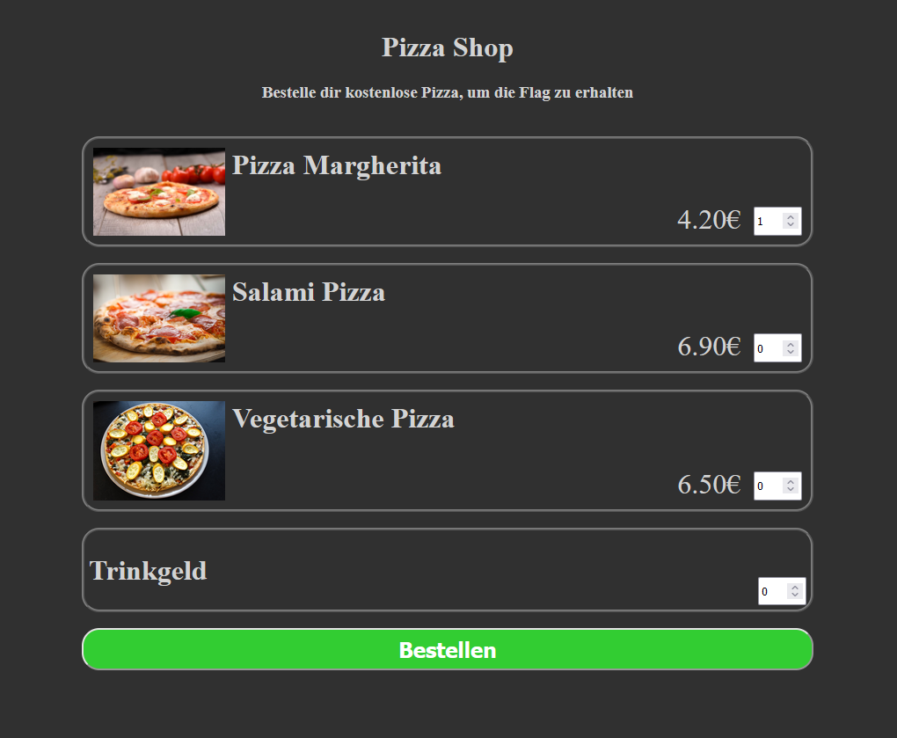

# Pizza

## Description:

A simple "pizza shop"with an easy logical vulnerability. The goal is to order at least one pizza for 0€ or less. If this is the case, the flag is displayed.

## Setting up the challenge:

Build the docker image using the provided Dockerfile or use the image provided on DockerHub ([pkemkes/ctf-pizza](https://hub.docker.com/repository/docker/pkemkes/ctf-pizza/general)).

There is one important environment value that should be set when deploying the image on your challenge server:

| Name | Default                         | Description                                                                                                              |
|------|---------------------------------|--------------------------------------------------------------------------------------------------------------------------|
| FLAG | flag{replace-me-with-your-flag} | The flag that is displayed when the challenge is won. Replace this with your flag that is registered in your CTF server. |

### Example docker-compose.yml:

```yaml
services:
  ctf-pizza:
    image: pkemkes/ctf-pizza
    container_name: ctf-pizza
    restart: always
    environment:
      - FLAG=flag{very-secret-flag}
    ports:
      - "8080:8080"
```

## Screenshot:

