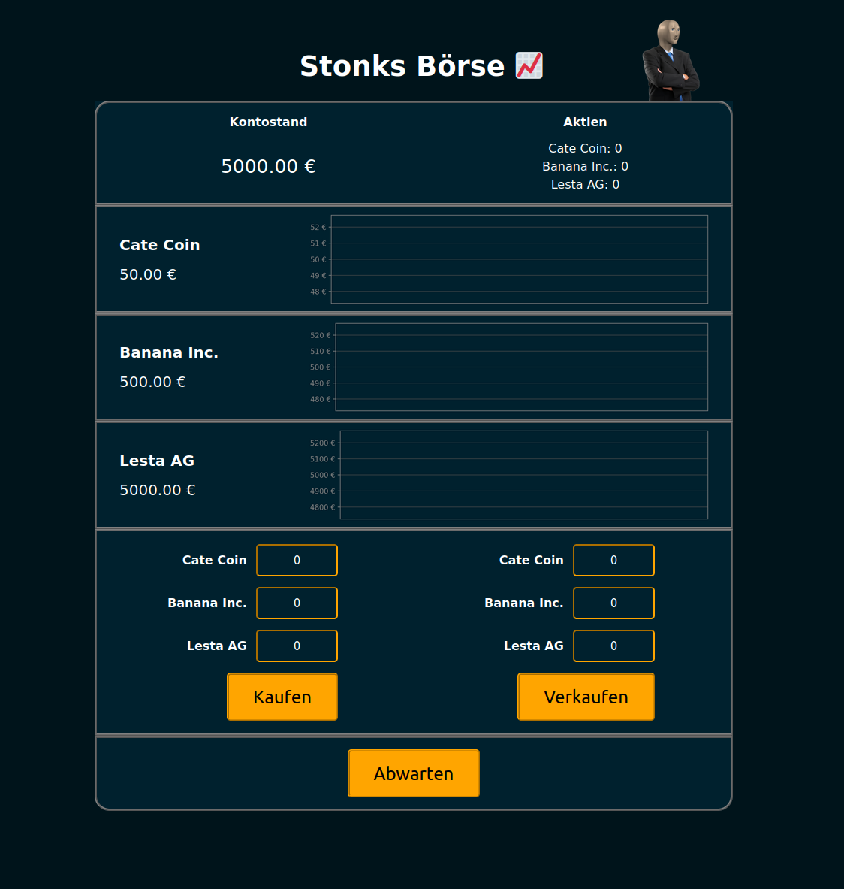

# Stonks Boerse

## Description:

A simple "stocks" app with an easy logical vulnerability. The goal is to reach an account balance of more than 1,000,000,000,000,000 €. If this is the case, the flag is displayed.

This is a challenge for beginners with 2 difficulty settings. It is currently in German but can easily be modified to support English players.

## Setting up the challenge:

Build the docker image using the provided Dockerfile or use the image provided on DockerHub ([pkemkes/ctf-stonks-boerse](https://hub.docker.com/repository/docker/pkemkes/ctf-stonks-boerse/general)).

There are three important environment value that should be set when deploying the image on your challenge server:

| Name | Default | Description |
|--------|--------|---|
| DIFFICULTY | 0 | Determines the difficulty of the challengen. Possible values: 0, 1 |
| USER_DATA_DIR | /var/www/user_data | This is the directory used to store the user session data. You should create a volume for this path, if you want to persist the data between restarts. |
| FLAG | flag{replace-me-with-your-flag} | The flag that is displayed when the challenge is won. Replace this with your flag that is registered in your CTF server. |

### Example docker-compose.yml:

```yaml
ctf-stonks-0:
    image: pkemkes/ctf-stonks-boerse
    container_name: ctf-stonks-0
    restart: always
    environment:
        - DIFFICULTY=0
        - FLAG=flag{this-is-a-very-secret-flag}
    ports:
        - "80:80"
    volumes:
        - ctf-stonks-0:/var/www/user_data

ctf-stonks-1:
    image: pkemkes/ctf-stonks-boerse
    container_name: ctf-stonks-1
    restart: always
    environment:
        - DIFFICULTY=1
        - FLAG=flag{this-is-another-very-secret-flag}
    ports:
        - "80:80"
    volumes:
        - ctf-stonks-1:/var/www/user_data

volumes:
    ctf-stonks-0:
        driver: local
    ctf-stonks-1:
        driver: local
```

## Screenshot:

