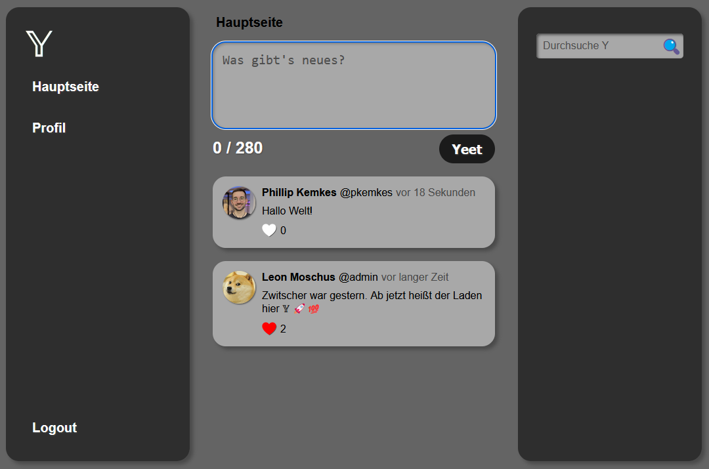

# Y Challenge

## Description:

This challenge simulates a well known social media platform. It reeks of many well known security issues (SQLi, XSS, IDOR). Currently two vulnerabilities are implemented with flags: IDOR and SQLi.

## Setting up the challenge:

Build the docker image using the provided Dockerfile or use the image provided on DockerHub ([pkemkes/ctf-y](https://hub.docker.com/repository/docker/pkemkes/ctf-y/general)).

There are 5 important environment value that should be set when deploying the image on your challenge server:

| Name | Default | Description |
|--------|--------|---|
| FLAG1 | flag{replace-me-with-your-first-flag} | The comma-separated flag that is displayed when the IDOR challenge is solved. Replace this with your flag that is registered in your CTF server. |
| FLAG2 | flag{replace-me-with-your-second-flag} | The comma-separated flag that is displayed when the SQLi challenge is solved. Replace this with your flag that is registered in your CTF server. |
| SOFT_RESET_PATH | /soft-reset | The path in the web application that can be used to delete all messages ("yeets") in the system, except the ones created by the admin account. All user accounts will not be changed. You should change this in your deployment, if you do not want your players to find this. |
| HARD_RESET_PATH | /hard-reset | The path in the web application that can be used to drop all tables from the database and reset the system into its initial state. You should change this in your deployment, if you do not want your players to find this. |

### Example docker-compose.yml:

```yaml
ctf-y:
    image: pkemkes/ctf-y
    container_name: ctf-y
    restart: always
    environment:
        - FLAG1=flag{IDOR-flag}
        - FLAG2=flag{SQLi-flag}
        - SOFT_RESET_PATH=/soft-reset-WbC08Kj6mLs8KbvXxNlL
        - HARD_RESET_PATH=/hard-reset-keQxNkHoT2fLOaO9uEVa
    ports:
        - "8080:8080"
    volumes:
        - ctf-y:/var/www/data

volumes:
    ctf-y:
        driver: local
```

## Screenshot:

