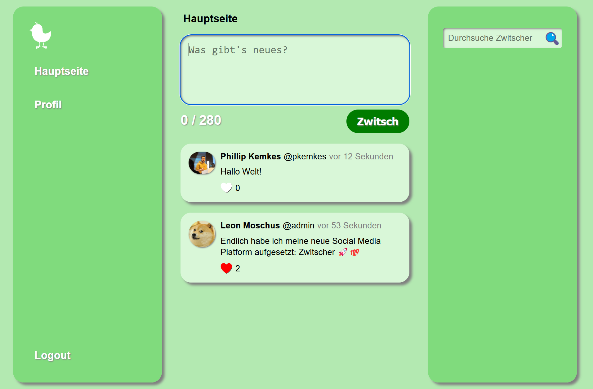

# Zwitscher Challenge

## Description:

This challenge simulates a well known social media platform. It reeks of many well known security issues (SQLi, XSS, IDOR). Currently two vulnerabilities are implemented with flags: IDOR and SQLi.

## Setting up the challenge:

Build the docker image using the provided Dockerfile or use the image provided on DockerHub ([pkemkes/ctf-zwitscher](https://hub.docker.com/repository/docker/pkemkes/ctf-zwitscher/general)).

There are 3 important environment value that should be set when deploying the image on your challenge server:

| Name | Default | Description |
|--------|--------|---|
| FLAG1 | flag{replace-me-with-your-first-flag} | The comma-separated flag that is displayed when the IDOR challenge is solved. Replace this with your flag that is registered in your CTF server. |
| FLAG2 | flag{replace-me-with-your-second-flag} | The comma-separated flag that is displayed when the SQLi challenge is solved. Replace this with your flag that is registered in your CTF server. |
| DATADIR | /var/www/data | This is the directory used to store the database and user data. You should create a volume for this path, if you want to persist the data between restarts. |

### Example docker-compose.yml:

```yaml
ctf-zwitscher:
    image: pkemkes/ctf-zwitscher
    container_name: ctf-zwitscher
    restart: always
    environment:
        - FLAG1=flag{IDOR-flag}
        - FLAG2=flag{SQLi-flag}
    ports:
        - "80:80"
    volumes:
        - ctf-zwitscher:/var/www/data

volumes:
    ctf-zwitscher:
        driver: local
```

## Screenshot:

